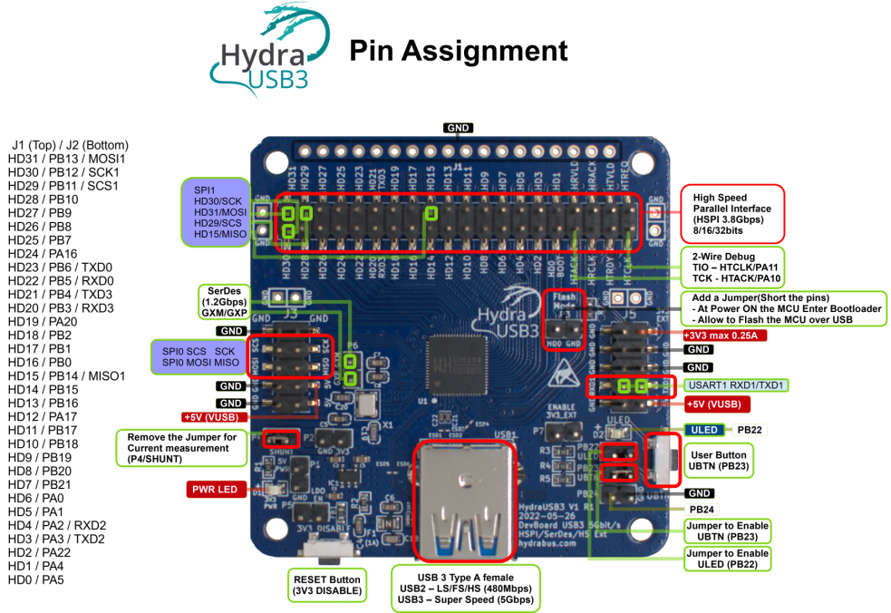

HydraUSB3 Hardware
========

HydraUSB3 V1 is an open source developer kit for the WCH CH569 MCU to experiment with streaming / high-speed protocols like HSPI and SerDes through USB3.

You can Buy HydraUSB3 Online: http://hydrabus.com/buy-online

Wiki Getting Started: https://github.com/hydrausb3/hydrausb3_fw/wiki/Getting-Started-with-HydraUSB3

HydraUSB3 (WCH CH569) test firmware / examples / libraries
========

Wiki for HydraUSB3 test firmware / examples / libraries: https://github.com/hydrausb3/hydrausb3_fw/wiki

See https://github.com/hydrausb3/hydrausb3_fw

To build HydraUSB3 test firmware examples see instructions here: 
* Windows: https://github.com/hydrausb3/hydrausb3_fw/wiki/how-to-build-flash-and-use-examples-on-windows
* Linux: https://github.com/hydrausb3/hydrausb3_fw/wiki/how-to-build-flash-and-use-examples-on-linux

